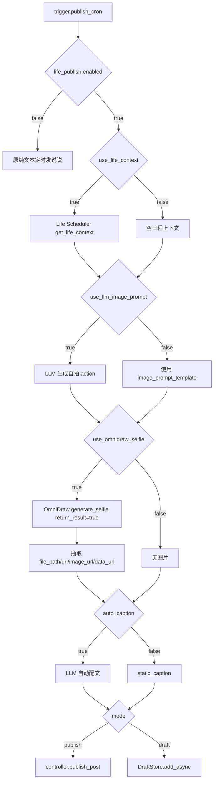

# QQ 空间定时生活说说联动方案

## 目标

在 QQ 空间 Ultra 的定时发说说任务中，可选启用 Life Scheduler 与 OmniDraw：

1. 到达 `trigger.publish_cron` 时间。
2. 读取 Life Scheduler 的 `get_life_context()`。
3. 让 LLM 根据日程生成 OmniDraw 自拍 action/prompt。
4. 调用 OmniDraw `generate_selfie(return_result=true)` 返回图片，不自动下发。
5. 根据日程与自拍提示词自动配文。
6. 直接发 QQ 空间说说，或写入待审核草稿。

所有阶段均由 `life_publish.*` 配置开关控制，默认关闭。

## 数据流



## 配置项

- `life_publish.enabled`：总开关。默认 `false`。
- `life_publish.use_life_context`：是否调用 Life Scheduler。默认 `true`。
- `life_publish.use_llm_image_prompt`：是否让 LLM 写自拍提示词。默认 `true`。
- `life_publish.use_omnidraw_selfie`：是否调用 OmniDraw 自拍生图。默认 `true`。
- `life_publish.auto_caption`：是否让 LLM 自动写说说文案。默认 `true`。
- `life_publish.mode`：`publish` 直接发布，`draft` 只存草稿。
- `life_publish.failure_policy`：`skip` 任一关键阶段失败则跳过；`text_only` 生图失败仍可发/存文字。
- `life_publish.aspect_ratio` / `size` / `extra_params`：透传给 OmniDraw 自拍接口。
- `life_publish.static_caption`：固定配文或自动配文失败兜底。
- `life_publish.image_prompt_template`：自拍提示词模板，支持 `{life_context}`。
- `life_publish.caption_prompt`：配文模板，支持 `{life_context}`、`{image_prompt}`。

## 跨插件接口约定

### Life Scheduler

QQ 空间插件通过 AstrBot `context.get_registered_star("astrbot_plugin_life_scheduler")` 获取插件实例，并调用：

```python
life_data = await life_scheduler_plugin.get_life_context()
```

期望返回：

```json
{
  "outfit": "今日穿搭",
  "schedule": "今日日程",
  "meta": {"style": "穿搭风格"},
  "timeline": []
}
```

### OmniDraw

QQ 空间插件通过 AstrBot `context.get_registered_star("astrbot_plugin_omnidraw")` 获取插件实例，并只使用返回式自拍接口：

```python
raw = await omnidraw.generate_selfie(
    event,
    action=image_prompt,
    count=1,
    aspect_ratio=settings.life_publish_aspect_ratio,
    size=settings.life_publish_size,
    extra_params=settings.life_publish_extra_params,
    return_result=True,
    refs="",
)
```

若实例方法名是 `tool_generate_selfie`，QQ 空间侧也兼容，但仍传 `return_result=True`。

返回值可以是 dict 或 JSON 字符串，期望结构：

```json
{
  "success": true,
  "message": "ok",
  "images": [
    {
      "file_path": "D:/path/to/image.png",
      "url": "https://...",
      "image_url": "https://...",
      "data_url": "data:image/png;base64,..."
    }
  ]
}
```

图片源优先级：`file_path` → `url` → `image_url` → `data_url`。

## 失败策略

- `skip`：Life Scheduler 缺失、LLM 提示词为空、OmniDraw 缺失/失败/无图时直接跳过本次发布。
- `text_only`：Life Scheduler 或 OmniDraw 失败时，仍尝试用固定/LLM 文案发文字说说或存草稿。

## OmniDraw 侧验收清单

1. `generate_selfie` 或 `tool_generate_selfie` 支持 `return_result=True`。
2. `return_result=True` 时不调用 `event.send()` / 不自动下发图片。
3. 返回 JSON 字符串或 dict，包含 `success`、`message`、`images`。
4. `images[*]` 至少提供 `file_path`、`url`、`image_url`、`data_url` 之一。
5. 支持 `count`、`aspect_ratio`、`size`、`extra_params`、`refs` 参数。
6. 权限/额度检查仍可用传入 event 归属到调用方配置的管理员或管理群。
